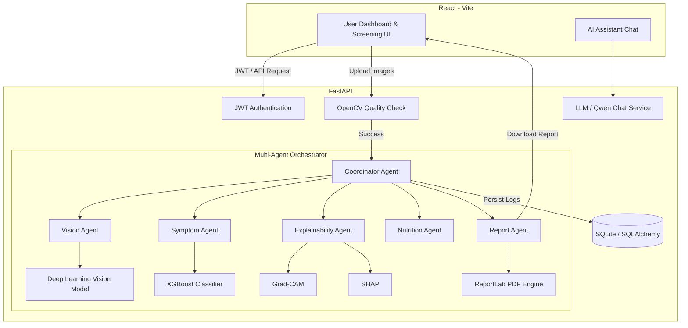

<p align="center">
  <h1 align="center">🩸🔬 HemaVision AI</h1>
  <p align="center">
    <strong>Multimodal AI Screening & Clinical Decision Support for Hematological Conditions</strong>
  </p>
  <p align="center">
    <em>Screen from eyes, nails & tongue · Explainable AI diagnostics · Nutrition guidance · Clinical PDF reports</em>
  </p>
  <p align="center">
    
    
    
    
    
    
  </p>
</p>

---

## 📖 Overview

**HemaVision AI** is a production-ready, full-stack medical screening and clinical decision support system. It combines **multi-agent orchestration**, **deep learning vision models**, **explainable AI (XAI)**, and **symptom risk profiling** to assist in the early detection and screening of hematological conditions such as **anemia**.

The system integrates multi-modal patient inputs — **eye (palpebral conjunctiva)**, **nail**, and **tongue** clinical imagery alongside interactive symptom surveys — to produce fused diagnostics, explainability maps, automated nutrition recommendations, and professional clinical PDF reports.

> **Why this project?**
> Anemia and related hematological conditions are frequently under-detected, especially in low-resource settings without easy access to blood tests. HemaVision AI provides an accessible, camera-based, first-line screening layer — combining computer vision with symptom data and transparent, explainable outputs — to flag risk early and guide patients toward appropriate care.

> ⚠️ **Clinical Disclaimer**: HemaVision AI is built for **educational, research, and screening-assistance purposes only**. It does **not** replace professional medical diagnosis, advice, or treatment.

---

## ✨ Key Features

| Feature | Description |
|---------|-------------|
| 🖼️ **Multimodal Screening** | Analyzes photographic inputs of **eyes**, **nails**, and **tongues** alongside standard symptom indicators for a fused risk assessment. |
| 🤖 **Multi-Agent Diagnostic Coordinator** | An orchestrator pattern coordinating dedicated agents (`VisionAgent`, `SymptomAgent`, `ExplainabilityAgent`, `NutritionAgent`, `ReportAgent`) into a unified diagnostic state. |
| 🔍 **Explainable AI (XAI)** | **Grad-CAM** visual attention maps highlight clinical regions (e.g. pallor); **SHAP** attributes symptom-level contributions to the classifier's decision. |
| 📷 **Dynamic Image Quality Guards** | OpenCV-based pre-screening (Variance of Laplacian for blur, mean pixel intensity for exposure) ensures clinical validity before inference. |
| 💬 **AI Chat Assistant** | Embedded chat companion powered by local/remote LLM (`Qwen/Qwen2.5`) for general patient health questions. |
| 📄 **Clinical PDF Reporting** | Auto-compiles findings, modality risk metrics, dietary recommendations, and explainability maps into an exportable, professional PDF. |
| 📊 **Interactive Analytics Dashboard** | Visualizes health profile details, diagnostic history charts, and longitudinal progress tracking. |
| 🔐 **Secure Authentication** | JWT-based auth flow with SHA256 password hashing via `passlib` and `bcrypt`. |

---

## 🏗️ Architecture



---

## 🛠️ Tech Stack

### Frontend
| Technology | Purpose |
|------------|---------|
| React 19 | Component-based reactive UI |
| Vite | Build tooling & hot module reload |
| TailwindCSS / Vanilla CSS | Styling & design system |
| Chart.js / Recharts | Analytics dashboard visualizations |

### Backend
| Technology | Purpose |
|------------|---------|
| FastAPI | Async REST API server |
| Uvicorn | ASGI server |
| SQLAlchemy | ORM layer |
| SQLite | Persistent storage (diagnostic logs, users) |
| Pydantic | Request/response validation & schemas |
| passlib / bcrypt | Password hashing |

### Machine Learning & Clinical Tools
| Technology | Purpose |
|------------|---------|
| PyTorch / torchvision | Deep learning vision model for image classification |
| XGBoost | Symptom-based risk classifier |
| Grad-CAM | Visual explainability for vision model predictions |
| SHAP | Feature attribution for symptom classifier |
| Sentence-Transformers | Text/semantic processing support |
| OpenCV | Image quality checks (blur, brightness/exposure) |
| ReportLab | Clinical PDF report generation |

### Infrastructure
| Technology | Purpose |
|------------|---------|
| Docker / Docker Compose | Containerized full-stack deployment |
| Hugging Face Spaces / Render / Railway | Hosting options |

---

## 📂 Project Structure

```
hemavision_ai/
├── docker-compose.yml
│
├── backend/
│   ├── requirements.txt
│   ├── .env.example
│   ├── hemavision.db           # SQLite database (auto-created)
│   └── app/
│       ├── main.py             # FastAPI entrypoint
│       ├── core/
│       │   ├── config.py       # Settings & environment config
│       │   └── security.py     # JWT auth & password hashing
│       ├── agents/
│       │   ├── coordinator.py      # Orchestrator agent
│       │   ├── vision_agent.py     # Deep learning vision inference
│       │   ├── symptom_agent.py    # XGBoost symptom classifier
│       │   ├── explainability_agent.py  # Grad-CAM + SHAP
│       │   ├── nutrition_agent.py  # Diet & nutrition recommendations
│       │   └── report_agent.py     # PDF report compilation
│       ├── models/
│       │   ├── vision_model.pt     # Trained deep learning model
│       │   ├── symptom_model.pkl   # Trained XGBoost classifier
│       │   └── shap_explainer.pkl  # SHAP explainer artifact
│       ├── services/
│       │   ├── quality_guard.py    # OpenCV image quality checks
│       │   └── llm_service.py      # Qwen2.5 chat integration
│       ├── db/
│       │   ├── database.py
│       │   └── models.py           # SQLAlchemy ORM models
│       └── routes/
│           ├── auth.py
│           ├── screening.py
│           ├── chat.py
│           ├── history.py
│           └── report.py
│
└── frontend/
    ├── package.json
    ├── vite.config.js
    ├── .env
    └── src/
        ├── main.jsx
        ├── App.jsx
        ├── api.js
        ├── components/
        │   ├── Navbar.jsx
        │   ├── ImageUpload.jsx
        │   ├── SymptomSurvey.jsx
        │   ├── GradCAMViewer.jsx
        │   ├── SHAPChart.jsx
        │   └── ChatBubble.jsx
        └── pages/
            ├── LandingPage.jsx
            ├── ScreeningPage.jsx
            ├── DashboardPage.jsx
            ├── HistoryPage.jsx
            └── ChatPage.jsx
```

---

## ⚙️ Getting Started

### Prerequisites
- **Python** 3.10+
- **Node.js** 18+ and **npm**
- **Docker** (optional, for containerized run)

### 1️⃣ Clone the Repository

```bash
git clone https://github.com/Nive4/hemavision_ai.git
cd hemavision_ai
```

### 2️⃣ Backend Setup

```bash
cd backend
python -m venv venv
source venv/Scripts/activate     # Windows: venv\Scripts\activate

pip install --upgrade pip
pip install torch torchvision --index-url https://download.pytorch.org/whl/cpu
pip install -r requirements.txt
```

Configure your `.env` (see `.env.example`):

```env
PROJECT_NAME="HemaVision AI"
SECRET_KEY="your-custom-jwt-secret-key"
DATABASE_URL="sqlite:///./hemavision.db"
HF_LLM_MODEL="Qwen/Qwen2.5-1.5B-Instruct"
```

Launch the API server:

```bash
uvicorn app.main:app --reload --host 127.0.0.1 --port 8000
```

### 3️⃣ Frontend Setup

```bash
cd frontend
npm install
```

Configure `frontend/.env`:

```env
VITE_API_URL="http://localhost:8000"
```

Run the dev server:

```bash
npm run dev
```

The React app runs on **`http://localhost:5173`**, the FastAPI backend on **`http://localhost:8000`** (interactive docs at `/docs`).

---

## 🐳 Containerized Running (Docker Compose)

Launch the entire full-stack app (React + FastAPI + DB) in a single command:

```bash
docker-compose up --build
```

Once healthy, access:
- **Frontend**: `http://localhost:5173`
- **Backend API docs**: `http://localhost:8000/docs`

---

## 🔌 API Reference

All endpoints are prefixed with `/api`.

### Authentication

| Method | Endpoint | Description |
|--------|----------|-------------|
| `POST` | `/api/auth/register` | Register a new patient/user account |
| `POST` | `/api/auth/login` | Authenticate and receive a JWT access token |

### Screening

| Method | Endpoint | Description |
|--------|----------|-------------|
| `POST` | `/api/screening/upload` | Upload eye/nail/tongue images + symptom survey → runs quality guard, vision & symptom agents |
| `GET` | `/api/screening/:id` | Retrieve a specific screening result, including SHAP and Grad-CAM outputs |

### AI Chat

| Method | Endpoint | Description |
|--------|----------|-------------|
| `POST` | `/api/chat` | Send a message (with conversation history) to the Qwen-powered health assistant |

### History & Analytics

| Method | Endpoint | Description |
|--------|----------|-------------|
| `GET` | `/api/history` | Retrieve all saved screenings for the authenticated user |
| `DELETE` | `/api/history/:id` | Delete a screening record |
| `GET` | `/api/stats` | Aggregate analytics (risk distribution, longitudinal trends) |

### Reports

| Method | Endpoint | Description |
|--------|----------|-------------|
| `GET` | `/api/report/:id` | Download a clinical PDF report for a specific screening |

<details>
<summary><strong>📋 Example: POST /api/screening/upload</strong></summary>

**Request (multipart/form-data):**
```
eye_image: <file>
nail_image: <file>
tongue_image: <file>
symptoms: {
  "fatigue": true,
  "dizziness": true,
  "shortness_of_breath": false,
  "pale_skin": true,
  "cold_hands_feet": false
}
```

**Response:**
```json
{
  "id": "scr_8f21ab",
  "risk_level": "Moderate",
  "modality_scores": {
    "eye": 0.62,
    "nail": 0.54,
    "tongue": 0.48,
    "symptoms": 0.58
  },
  "fused_score": 0.57,
  "explainability": {
    "gradcam_url": "/static/gradcam/scr_8f21ab_eye.png",
    "shap_top_features": {
      "fatigue": 0.31,
      "pale_skin": 0.27,
      "dizziness": 0.14
    }
  },
  "nutrition_plan": "## Iron-Rich Diet Plan\n...",
  "report_url": "/api/report/scr_8f21ab"
}
```
</details>

---

## 🔒 Security & Clinical Disclaimer

- **Authentication**: Secure JWT-based authentication flow with SHA256 password hashing via `passlib` and `bcrypt`.
- **Data Handling**: Uploaded images and symptom data are processed for screening purposes and stored locally via SQLite; no data is shared with third parties.
- **Disclaimer**: *HemaVision AI* is built for **educational, research, and screening-assistance purposes**. It does **not** replace professional medical diagnosis, advice, or therapy. Always consult a qualified healthcare provider for medical concerns.

---

## 🤝 Contributing

Contributions are welcome! Here's how:

1. Fork the repository
2. Create a feature branch (`git checkout -b feature/amazing-feature`)
3. Commit your changes (`git commit -m 'Add amazing feature'`)
4. Push to the branch (`git push origin feature/amazing-feature`)
5. Open a Pull Request

---

## 📄 License

This project is open-source and available under the [MIT License](LICENSE).

---

## 🙏 Acknowledgments

- **[PyTorch](https://pytorch.org/)** — Deep learning framework powering the vision model
- **[XGBoost](https://xgboost.readthedocs.io/)** — Gradient boosting framework for symptom risk classification
- **[SHAP](https://github.com/shap/shap)** — Explainable AI framework for model interpretability
- **[Grad-CAM](https://arxiv.org/abs/1610.02391)** — Visual explanation technique for CNN predictions
- **[Qwen2.5](https://huggingface.co/Qwen)** — LLM powering the AI health assistant chat

---

<p align="center">
  <strong>Crafted with 🩸 by Nivethitha</strong>
  <br/>
  <em>Powered by PyTorch, XGBoost & Explainable AI</em>
</p>