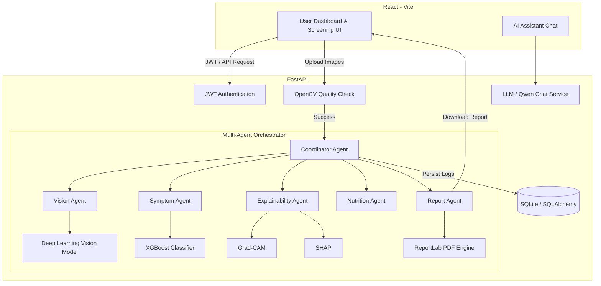

# HemaVision AI 🩸🔬

HemaVision AI is a production-ready, full-stack medical screening and clinical decision support system. It leverages multi-agent orchestrations, deep learning vision models, explainable AI (XAI), and symptom risk profiling to assist in early detection and screening of hematological conditions (such as anemia).

The system integrates multi-modal patient inputs—specifically eye, nail, and tongue clinical imagery alongside interactive symptom surveys—to yield fused diagnostics, explainability maps, automated nutrition recommendations, and professional clinical PDF reports.

---

## 🚀 Key Features

*   **Multimodal Screening**: Analyzes photographic inputs of **eyes (palpebral conjunctiva)**, **nails**, and **tongues** alongside standard symptom indicators.
*   **Multi-Agent Diagnostic Coordinator**: An orchestrator pattern that coordinates dedicated agents (`VisionAgent`, `SymptomAgent`, `ExplainabilityAgent`, `NutritionAgent`, and `ReportAgent`) to build a unified diagnostic state.
*   **Computer Vision & Explainable AI (XAI)**:
    *   **Grad-CAM**: Computes visual attention maps overlaying the input image to highlight clinical diagnostic regions (e.g., pallor detection).
    *   **SHAP (SHapley Additive exPlanations)**: Calculates the game-theoretic feature attribution of input symptoms to explain the classifier's decisions.
*   **Dynamic Image Quality Guards**: Pre-screens uploaded photos using OpenCV (Variance of Laplacian for blur detection, mean pixel intensity for brightness/exposure) to ensure clinical validity before running models.
*   **AI Chat Assistant**: Embedded chat companion powered by local/remote LLM configurations (`Qwen/Qwen2.5`) for patients to query general health questions.
*   **Clinical PDF Reporting**: Automatically compiles all findings, modality risk metrics, dietary recommendations, and explainability maps into an exportable, professional PDF.
*   **Interactive Analytics Dashboard**: Visualizes health profile details, diagnostic history charts, and longitudinal progress tracking.

---

## 🏗️ Architecture Flow



---

## 🛠️ Tech Stack

*   **Frontend**: React, Vite, TailwindCSS / Vanilla CSS, Chart.js / Recharts.
*   **Backend**: FastAPI, Uvicorn, SQLAlchemy, SQLite, Pydantic.
*   **Machine Learning**: PyTorch, torchvision, XGBoost, Grad-CAM, SHAP, Sentence-Transformers.
*   **Clinical Tools**: OpenCV (Image Pre-processing), ReportLab (PDF Generation).
*   **Infrastructure**: Docker, Docker Compose, Hugging Face Spaces (or Render/Railway).

---

## ⚙️ Local Installation & Development

### Prerequisites
*   Python 3.10+
*   Node.js 18+
*   Docker (Optional)

### 1. Clone the Repository
```bash
git clone https://github.com/Nive4/hemavision_ai.git
cd hemavision_ai
```

### 2. Backend Setup
1. Navigate to the backend folder and create a virtual environment:
   ```bash
   cd backend
   python -m venv venv
   source venv/Scripts/activate # On Windows: venv\Scripts\activate
   ```
2. Install Python packages:
   ```bash
   pip install --upgrade pip
   pip install torch torchvision --index-url https://download.pytorch.org/whl/cpu
   pip install -r requirements.txt
   ```
3. Set up your `.env` configuration (Refer to `.env.example`):
   ```env
   PROJECT_NAME="HemaVision AI"
   SECRET_KEY="your-custom-jwt-secret-key"
   DATABASE_URL="sqlite:///./hemavision.db"
   HF_LLM_MODEL="Qwen/Qwen2.5-1.5B-Instruct"
   ```
4. Launch the FastAPI server:
   ```bash
   uvicorn app.main:app --reload --host 127.0.0.1 --port 8000
   ```

### 3. Frontend Setup
1. Open a new terminal and navigate to the frontend folder:
   ```bash
   cd frontend
   npm install
   ```
2. Set up environment variables in `frontend/.env`:
   ```env
   VITE_API_URL="http://localhost:8000"
   ```
3. Run the development server:
   ```bash
   npm run dev
   ```

---

## 🐳 Containerized Running (Docker Compose)

Launch the entire full-stack app (React + FastAPI + DB) in a single command:
```bash
docker-compose up --build
```
Once healthy, access:
*   Frontend: `http://localhost:5173`
*   Backend API documentation: `http://localhost:8000/docs`

---

## 🔒 Security & Clinical Disclaimer
*   **Authentication**: Secure authentication flow utilizing JWT tokens with SHA256 password hashing (via `passlib` & `bcrypt`).
*   **Disclaimer**: *HemaVision AI* is built for educational, research, and screening-assistance purposes. It does not replace professional medical diagnosis, advice, or therapy.
